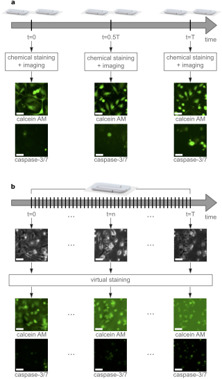

# Virtual live/apoptotic cell staining using cGAN

Train and evaluate conditional generative adveserial networks to virtually stain phase contrast images.

This project is powered by [DeepTrack 2.0](https://github.com/softmatterlab/DeepTrack-2.0)

## Installation

Clone the repository using `git clone https://github.com/softmatterlab/Live-apoptotic-virtual-staining`

### Installing dependencies using pip

Requires python >= 3.6

Open a terminal and run `pip install -r misc/requirements.txt`

For use with a GPU, please refer to [tensorflow](https://www.tensorflow.org/install/gpu)

## Running

### Train a model to virtually stain phase-contrast images

Open a terminal and run `python train.py setup -i [MODEL_INDEX] -e [NUMBER_OF_EPOCHS] -r [NUMBER OF REPETITIONS]`

### Use a trained model to virtually stain phase-contrast images

Open a terminal and run `python evaluate.py -t [DATASET] `

